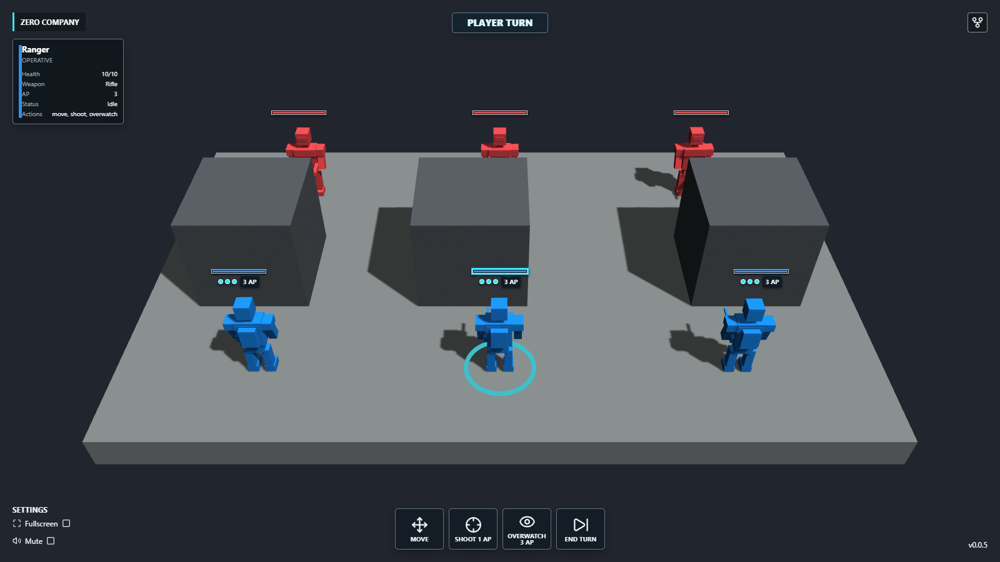

<!-- AI: Keep commands rooted at the repository. The Vite application, source, tests, and build output belong in zero-company/. -->

# Zero Company

Zero Company is a compact Babylon.js turn-based tactical game for desktop and
mobile browsers. It opens directly into one complete three-versus-three battle
with deterministic rules, three action points per unit, Move, Shoot,
Overwatch, sequential enemy AI, victory or defeat, and in-memory Restart. The
restrained greybox presentation uses local models and sounds, programmatic
character feedback, and focus-based camera controls.

Current version: `v0.0.5`

## Images

### Screenshot

## Live Demo

- [samuelasherrivello.github.io/babylon-lite-zero-company](https://samuelasherrivello.github.io/babylon-lite-zero-company/)

The local Vite build is the authoritative preview until this milestone is
pushed and the GitHub Pages deployment completes.

## Getting Started

Use the repository root for dependency, test, build, and run commands. The Vite
application lives in `zero-company/`.

### Install And Run

1. Run `npm install`.
2. Run `npm run dev`.
3. Open the local URL printed by Vite.

### Verify

- `npm test` runs the application, presentation, audio, and deterministic
  gameplay-rules suites.
- `npm run test:rules` runs only the deterministic gameplay-rules suite.
- `npm run build` creates the GitHub Pages build in `zero-company/dist/`.
- With Vite running at the default verified URL, `npm run test:browser` checks
  desktop and mobile gameplay, camera gestures, responsive HUD alignment,
  local-only/offline requests, visual and audio failure fallbacks, results,
  Restart, WebGL pixels, and the browser console. Set `ZERO_COMPANY_URL` when
  Vite uses a different port.

## Controls

- Select any operative or enemy with the primary mouse button or one-finger
  tap to inspect health, weapon, AP, and Status. Select its battlefield model
  to focus the camera.
- Select **Move**, then choose a colored destination cell. Blue, cyan, and
  yellow destinations cost one, two, and three AP respectively.
- Select **Shoot**, then select a highlighted visible enemy. The button shows
  the selected weapon's AP cost and the target preview shows hit chance and
  damage.
- Select **Overwatch**, aim its ground cone with a floor click or tap, then
  press **Overwatch** again to commit all remaining AP as reaction capacity.
- Select **End Turn** at any time. A confirmation appears while usable player
  AP remains; enemies then activate one at a time automatically.
- Hold the secondary mouse button and drag to orbit around the selected focus.
- Use the mouse wheel to zoom within the tactical camera limits.
- On a landscape touch device, drag with two fingers to orbit and pinch to zoom.
- Portrait mobile displays a rotate-device blocker and preserves battle,
  targeting, and camera state until landscape play resumes.

## Offline Behavior

Runtime gameplay does not load models, audio, fonts, rules, or telemetry from
external origins. After the local application is available, the complete
battle—including feedback, enemy turns, results, and Restart—remains playable
with external network access blocked. Browser audio starts only after an
eligible user gesture, and muted or rejected playback never blocks gameplay.

## Project Details

React owns the HTML interface in `ui_layer`, including the four template corner
roles, action bar, inspection panel, projected unit HUDs, result prompts,
loading/error states, and orientation blocker. Babylon.js owns the canvas and
scene in `content_layer`. A pure serializable rules layer owns the grid, AP,
combat, Overwatch, enemy planning, results, and Restart. Both rendered layers
share a centered 16:9 frame with dark letterboxing or pillarboxing.

The scene uses one original, locally bundled CC0 character GLB for all six
operatives plus four original CC0 local sound effects for movement, shooting,
impact, and Overwatch. Team materials distinguish blue and red units. Models,
materials, sounds, icons, and presentation feedback require no runtime internet
connection. Detailed provenance and asset filenames are recorded in
[zero-company/documentation/assets.md](zero-company/documentation/assets.md).

### Structure

- `zero-company/src/game/` contains deterministic rules, scene descriptors,
  construction, lifecycle, projected HUD coordinates, picking, camera input,
  presentation sequencing, and local audio control.
- `zero-company/src/App.jsx` connects the rules state to the React interface and
  Babylon presentation queue.
- `zero-company/test/` contains focused Node and real-browser smoke checks.
- `zero-company/public/assets/` contains runtime-local game assets.
- `zero-company/documentation/` contains research, provenance, and the canonical
  screenshot.
- `openspec/` contains active and accepted project specifications.

### Packages

- [Babylon.js](https://www.babylonjs.com/) renders the 3D scene.
- [React](https://react.dev/) renders the accessible HTML interface.
- [Lucide](https://lucide.dev/) provides interface icons.
- [Vite](https://vite.dev/) provides local development and production builds.

## Release Version

1. Update `version.txt` and this README's **Current version** to the same new,
   unused semantic version.
2. Run `npm test`, `npm run build`, and the documented browser verification.
3. Push the verified release commit to `main` and confirm the GitHub Pages
   deployment.
4. Run the **Release** workflow from GitHub Actions. It validates the committed
   version, creates its non-overwriting tag, and publishes the GitHub release.

## Credits

### Contributors

- Samuel Asher Rivello - Over 25 years of game development XP (2026)

### Contact

- [LinkedIn.com/in/SamuelAsherRivello](https://Linkedin.com/in/SamuelAsherRivello)
- [GitHub.com/SamuelAsherRivello](https://github.com/SamuelAsherRivello/)
- [Twitter.com/srivello](https://twitter.com/srivello/)
- Resume / Portfolio: [SamuelAsherRivello.com](http://www.SamuelAsherRivello.com)

### License

- Provided as-is under the [MIT License](LICENSE).
- Copyright (c) 2026 Rivello Multimedia Consulting, LLC.
